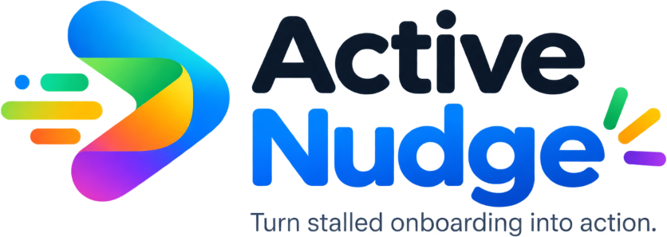
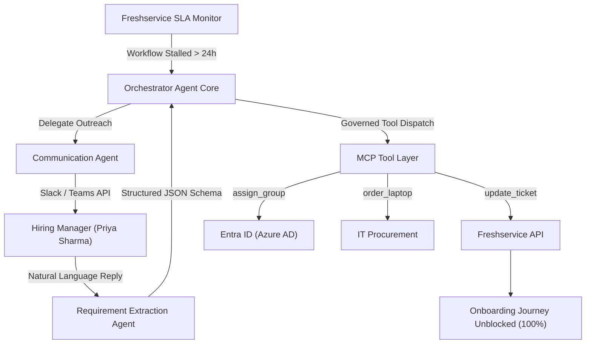

<div align="center">

  

  # Active Nudge
  ### Autonomous Employee Onboarding Agent

  **Turn stalled onboarding into action.**  
  *An autonomous agent that removes human bottlenecks before they become day-one problems.*

  [](https://freshworks.com)
  [-10B981?style=for-the-badge)](https://modelcontextprotocol.io)

</div>

---

## ⚡ Executive Summary

Traditional employee onboarding workflows are **passive**. When a hiring manager forgets to fill out a hardware or software request portal form, the workflow grinds to a halt — resulting in **28+ hours of day-one friction** for new hires.

**Active Nudge** flips this paradigm. Built for **Freshworks Agent Studio**, Active Nudge is an autonomous workflow resolution agent that continuously monitors Freshservice Onboarding Journeys. The moment a workflow stalls, the AI **takes initiative**:

1. 🔍 **Detects** the stalled workflow state and identifies responsible personnel.
2. 💬 **Proactively Contacts** the hiring manager via Slack or Microsoft Teams.
3. 🧠 **Understands** natural language responses (e.g. *"MacBook please. He needs GitHub and Figma access. No Jira."*).
4. ⚙️ **Extracts** structured requirements with confidence metrics.
5. 🚀 **Orchestrates** multi-agent execution via the **Model Context Protocol (MCP)** tool layer.
6. 🎯 **Automatically Unblocks** the Freshservice onboarding workflow in minutes.

---

## 🚀 Defining Agentic Principle

> **Traditional chatbots wait to be asked. Active Nudge detects bottlenecks and takes initiative.**

<div align="center">

`Detect` ➔ `Decide` ➔ `Proactively Act` ➔ `Understand` ➔ `Execute` ➔ `Verify` ➔ `Resolve`

</div>

---

## 🏆 Prototype Core Scenario

| Attribute | Details |
| :--- | :--- |
| **New Employee** | **Rahul Kumar** (Software Engineer, Engineering) |
| **Joining Date** | **August 30, 2026** (In 3 days) |
| **Hiring Manager** | **Priya Sharma** |
| **Bottleneck Reason** | Manager input missing for **26 hours** (Hardware & Dev software) |
| **Manager Natural Reply** | *"MacBook please. He needs GitHub and Figma access. No Jira for now."* |
| **Extracted Fields** | 💻 MacBook Pro (Ready) • 🔧 GitHub (Bound) • 🎨 Figma (Provisioned) • 📋 Jira (Not Required) |
| **Impact Metric** | **26 Hours of potential delay eliminated in 3 min 12 sec** *(Prototype Scenario)* |

---

## 🎨 Key Features & Interactive Screens

### 1. 📊 Onboarding Command Center (`/overview`)
- High-impact **Hero Callout Banner**: *"Your onboarding workflow is stuck. Active Nudge already knows why."*
- **5 KPI Metrics Cards**: Active Onboardings (128), At Risk (07), AI Interventions (14), Avg Resolution (18m), AI Resolution Rate (87%).
- **Needs Attention Highlighted Card** for Rahul Kumar with live journey step progress.

### 2. 💬 AI Intervention & Conversational Outreach (`/intervention`)
- Realistic Slack/Teams outreach chat interface with hiring manager Priya Sharma.
- Real-time NLP requirement extraction cards with confidence badges (>95% confidence).
- Preset demo shortcut buttons + custom natural language chat input to let judges test custom responses.
- **IT License Escalation Simulation Toggle**: Test fallback reasoning when software seats are exhausted.

### 3. 🌿 Multi-Agent & MCP Activity Graph (`/orchestration`)
- Visual graph showing the **Orchestrator Agent** coordinating **Communication**, **Extraction**, and **Provisioning Agents**.
- **Model Context Protocol (MCP) Tool Gateway**: Governed access layer connecting to **Freshservice**, **Slack/Teams**, and **Entra ID**.
- Real-time audit execution feed displaying tool dispatch logs.

### 4. ✅ Onboarding Unblocked State (`/resolved`)
- 100% completion checklist and captured requirements table.
- Highlighted ROI metric: **`26 hours of potential delay eliminated`**.

### 5. 🛠️ Freshworks Agent Studio Canvas (`/agent_studio`)
- High-tech node-based workflow builder (`active_nudge_orchestrator.fsflow`) featuring an interactive **Node Inspector** panel.

### 6. 📈 Bottleneck Analytics (`/analytics`)
- Before vs. After Active Nudge performance comparison charts (28.4h reduced to 0.3h).

---

## 🏗️ Architecture & MCP Integration Layer



---

## 🎬 Built-in Guided Demo Mode

Active Nudge includes a built-in guided presentation mode for quick hackathon video recording:

1. Click **`Start Guided Hackathon Demo`** in the top-right corner.
2. Click **`Auto Play`** to automatically transition through all 6 presentation steps, or click **`Next Step`** manually as you speak.

---

## ⚙️ Quickstart & Local Setup

### Prerequisites
- **Node.js**: v18.0.0 or higher
- **npm**: v9.0.0 or higher

### Installation & Running

```bash
# 1. Clone the repository
git clone https://github.com/YOUR_USERNAME/active-nudge-freshworks.git

# 2. Navigate to project folder
cd active-nudge-freshworks

# 3. Install dependencies
npm install

# 4. Start local Vite dev server
npm run dev
```

Open `http://localhost:3000` in your browser.

### Building for Production

```bash
npm run build
```

---

## 🛠️ Technology Stack

- **Core**: React 18, TypeScript, Vite
- **Styling**: Vanilla Tailwind CSS v4, Custom Enterprise SaaS Tokens
- **Animations**: Framer Motion
- **Icons**: Lucide React
- **Target Platform**: Freshworks Agent Studio
- **Integration Layer**: Model Context Protocol (MCP)

---

## 📄 License & Transparency Disclaimer


Distributed under the **MIT License**.
